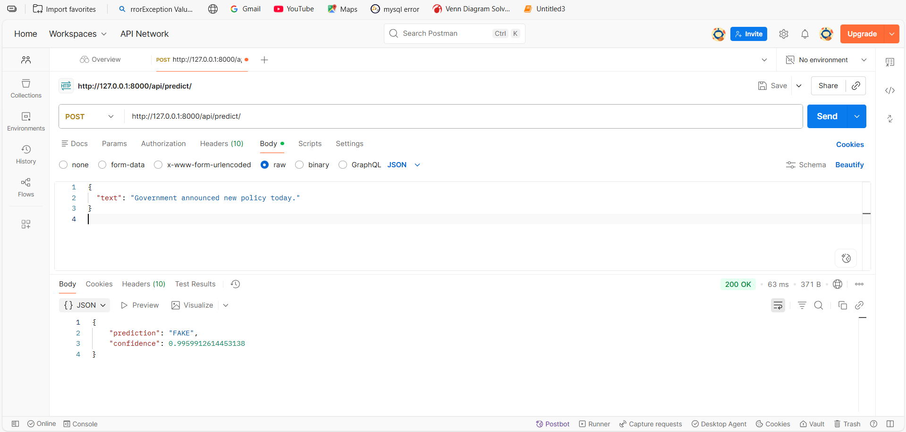
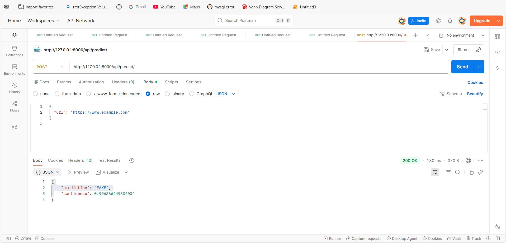
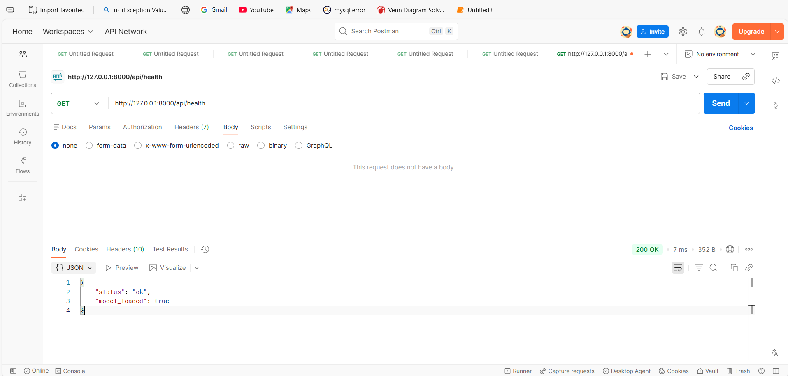

# 📰 Fake News Detection API

A Machine Learning powered **Django REST API** that classifies news articles 
as **FAKE or REAL** using Natural Language Processing (NLP) techniques and supervised learning models.

---

## 🚀 Project Overview

This project builds an end-to-end fake news detection system:
- Trains multiple ML models
- Selects the best-performing pipeline
- Exposes predictions via a REST API
- Supports both **text input** and **URL-based article extraction**

---

## 🧠 Architecture Diagram
Client (Postman / Frontend)
    |
    v
Django REST API
    |
    v
Text Preprocessing
(lowercase, cleaning)
    |
    v
TF-IDF Vectorizer
    |
    v
ML Classifier
(Logistic / RF / GB)
    |
    v
Prediction + Confidence
    |
    v
Database (Query Logs)

---

## 🧪 Machine Learning Pipeline
Raw News Text
    |
    v
Text Cleaning
    |
    v
TF-IDF Vectorization
    |
    v
GridSearchCV
    |
    v
Best Model Selection
    |
    v
Saved Pipeline (.pkl)

---

## 📊 Models Trained & Compared

| Model               | Tuned | Used GridSearch | Final Accuracy |
|---------------------|-------|-----------------|----------------|
| Logistic Regression |  ✅  |        ✅       |     ~99%       |
| Random Forest       |  ✅  |        ✅       |     ~98–99%    |
| Gradient Boosting   |  ✅  |        ✅       |     ~98%       |

Best model is saved as a **single pipeline** (`fake_news_model.pkl`).

---

## 🔌 API Endpoints

### ▶️ Predict News
**POST** `/api/predict/`

#### Request Body (Text)
{
  "text": "The government announced a new economic policy today..."
}

#### Request Body (URL)
{
  "url": "https://newswebsite.com/article"
}

#### Response
{
  "prediction": "REAL",
  "confidence": 0.98
}

####  Health Check
GET /api/health/
{
  "status": "ok",
  "model": "ready"
}
Used for deployment readiness checks.

##  API Testing Screenshots
###  Predict using Text

---
### Predict using URL

---
### Health Check

